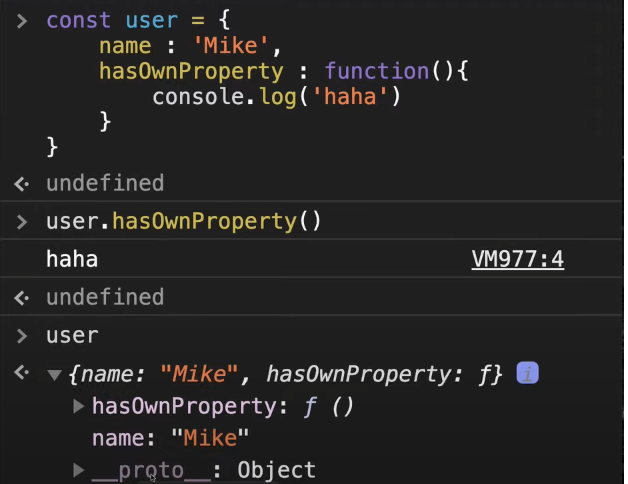

### 프로토타입
 


프로토타입은 user라는 객체안에 ___proto__안에 들어가있는 함수들  
예를 들어 hasOwnProperty() 정의가 되어있다면 haha로 출력이 되지만  
정의가 안되어있다면 프로토타입의 안의 함수로 인식됨  

```
car가 bmw의 상속을 받는 예제
const car = {
    wheels : 4,
    drive() {
        console.log("drive..");
    }
}

const bmw = {
    color:"red",
    wheels: 4,
    navigation: 1,
    drive() {
        console.log("drive..");
    }
}

bmw.__proto__ = car;
```

### prototype Chain
자바스크립트는 특정 객체의 프로퍼티나 메소드에 접근시 객체 자신의 것뿐 아니라  
__proto__가 가리키는 링크를 따라서 자신의 부모 역할을 하는  
프로토타입 객체의 프로퍼티나 메소드를 접근할 수 있다.  

```
//프로토타입을 선언해서 사용하는 예
const Bmw = (color) => {
    const c = color;
    this.getColor = () =>{
        console.log(c);
    }
}

Bmw.prototype ={
    constructor : Bmw,
    wheels : 4,
    drive() {
        console.log('drive..');
    },
    navigation:1,
    stop(){
        console.log("STOP!);
    }
}

const x5 = new Bmw('red');
const z4 = new Bmw('blue');

```