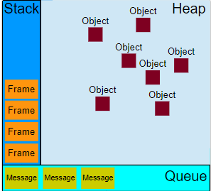

## 이벤트 루프
JavaScript의 런타임 모델은 코드의 실행, 이벤트의 수집과 처리,  
큐에 대기 중인 하위 작업을 처리하는 이벤트 루프에 기반하고 있으며, 
C 또는 Java 등 다른 언어가 가진 모델과는 상당히 다릅니다.



## 스택
함수의 호출들은 '프레임' 스택을 형성합니다.

```
function foo(b) {
  let a = 10
  return a + b + 11
}

function bar(x) {
  let y = 3
  return foo(x * y)
}

const baz = bar(7) // 42를 baz에 할당
```

1. bar를 호출할 때, bar의 인수와 지역 변수를 포함하는 첫 번째 프레임이 생성됩니다.
2. bar가 foo를 호출할 때, foo의 인수와 지역 변수를 포함하는 두 번째 프레임이 생성되어 첫 번째 프레임의 위로 푸시됩니다.
3. foo가 반환하면, 맨 위의 프레임 요소를 스택 밖으로 꺼냅니다. (bar 호출 프레임만 남음)
4. bar가 반환하면, 스택이 빕니다.

인수와 지역 변수는 스택 바깥에 저장되므로 바깥 함수가 반환한 후에도 계속 존재할 수 있습니다.  
중첩 함수에서 지역 변수에 접근할 수 있는 이유가 이것입니다.

## 힙
객체는 힙에 할당됩니다. 힙은 단순히 메모리의 큰 (그리고 대부분 구조화되지 않은) 영역을 지칭하는 용어입니다.  

## 큐
JavaScript 런타임은 메시지 큐, 즉 처리할 메시지의 대기열을 사용합니다.  
각각의 메시지에는 메시지를 처리하기 위한 함수가 연결돼있습니다.  

## 이벤트 루프
이벤트 루프는 이 기능을 구현할 때 보통 사용하는 방식에서 그 이름을 얻었으며, 대략 다음과 같은 형태입니다.  
```
while(queue.waitForMessage()){
  queue.processNextMessage();
}
```
queue.waitForMessage() 함수는 현재 처리할 수 있는 메시지가 존재하지 않으면 새로운 메시지가 도착할 때까지 동기적으로 대기합니다.  

### "Run-to-completion"
각 메시지의 처리는 다른 메시지의 처리를 시작하기 전에 완전히 끝납니다.  

이 특징은 프로그램의 동작을 추론할 때 유용한 특성을 제공합니다.  
실행한 함수가 다른 작업에 의해 선점될 일이 없고,  
다른 모든 코드의 실행보다 우선해서 값을 변경할 수 있으며,  
중단되는 일 없이 완전히 끝나기 때문입니다.  
반면, 예를 들어 C 언어에서는, 스레드에서 실행 중인 함수를 런타임 시스템이 임의로 멈추고 다른 스레드의 다른 코드를 먼저 실행할 수 있습니다.

이 모델의 단점은, 만약 메시지를 처리할 때 너무 오래 걸리면  
웹 애플리케이션이 클릭이나 스크롤과 같은 사용자 상호작용을 처리할 수 없다는 점입니다.  
브라우저는 "스크립트 응답 없음" 대화상자를 표시해서 이 문제를 완화합니다.  
개발자로서 사용할 수 있는 좋은 방법으로는 메시지 처리를 가볍게 유지하고,  
가능하다면 하나의 메시지를 여러 개로 나누는 것입니다.


출처 : https://developer.mozilla.org/ko/docs/Web/JavaScript/EventLoop