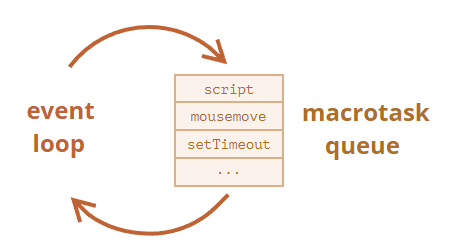

## 이벤트 루프

### 이벤트 루프와 매크로태스크, 마이크로태스크
브라우저 측 자바스크립트 실행 흐름은 Node.js와 마찬가지로 이벤트 루프에 기반합니다.  
따라서 이벤트 루프가 어떻게 동작하는지 잘 이해하고 있어야 최적화나 올바른 아키텍처 설계가 가능해집니다.  
이번 챕터에선 이벤트 루프가 어떻게 동작하는지에 대한 이론과 함께, 이를 어떻게 실무에 적용할 수 있는지에 대해서 알아보겠습니다.

### 이벤트 루프
이벤트 루프(event loop) 정의는 아주 간단합니다. 이벤트 루프는 태스크가 들어오길 기다렸다가 태스크가 들어오면 이를 처리하고, 처리할 태스크가 없는 경우엔 잠드는, 끊임없이 돌아가는 자바스크립트 내 루프입니다

자바스크립트 엔진이 돌아가는 알고리즘을 일반화하면 다음과 같습니다.
1. 처리해야 할 태스크가 있는 경우:
    - 먼저 들어온 태스크부터 순차적으로 처리함
2. 처리해야 할 태스크가 없는 경우:
    - 잠들어 있다가 새로운 태스크가 추가되면 다시 1로 돌아감

바로 이 알고리즘이 우리가 브라우저를 사용해 인터넷을 서핑할 때 돌아가는 알고리즘입니다. 이렇게 자바스크립트 엔진은 대부분의 시간 동안 아무런 일도 하지 않고 쉬고 있다가 스크립트나 핸들러, 이벤트가 활성화될 때만 돌아갑니다.  
그렇다면 자바스크립트 엔진을 활성화하는 태스크엔 과연 어떤 것들이 있을까요? 대표적인 태스크는 다음과 같습니다.  

- 외부 스크립트 <script src="...">가 로드될 때, 이 스크립트를 실행하는 것
- 사용자가 마우스를 움직일 때 mousemove 이벤트와 이벤트 핸들러를 실행하는 것
- setTimeout에서 설정한 시간이 다 된 경우, 콜백 함수를 실행하는 것
- 기타 등등

태스크는 하나의 집합을 이룹니다. 자바스크립트 엔진은 집합을 이루고 있는 태스크들을 차례대로 처리하고, 새로운 태스크가 추가될 때까지 기다립니다. 태스크를 기다리는 동안엔 CPU 자원 소비는 0에 가까워지고 엔진은 잠들게 됩니다.

새로운 태스크는 엔진이 바쁠 때 추가될 수도 있습니다. 이때 이 태스크는 큐에 추가됩니다.
이렇게 태스크가 추가되는 큐는 V8 용어로 '매크로태스크 큐(macrotask queue)'라고 부릅니다.




좀 더 구체적인 사례를 가지고 매크로태스크 큐에 대해 알아봅시다. 엔진이 script를 처리하느라 바쁜데 사용자가 마우스를 움직여 mousemove 이벤트를 활성화하고, 바로 이어서 setTimeout에서 설정한 시간이 지났다고 가정해 봅시다. 이때 세 태스크는 큐에 하나씩 추가되는데, 위 그림에 이런 상황을 묘사해 보았습니다.

큐에 있는 태스크들은 "들어간 순서대로" 처리됩니다. 엔진은 script를 먼저 처리하고 mousemove 이벤트와 핸들러, setTimeout 핸들러를 순차적으로 처리합니다.

1. 엔진이 특정 태스크를 처리하는 동안엔 렌더링이 절대 일어나지 않습니다. 태스크를 처리하는 데 걸리는 시간이 길지 않으면 이는 전혀 문제가 되지 않습니다. 처리가 끝나는 대로 DOM 변경을 화면에 반영하면 되기 때문입니다.
2. 태스크 처리에 긴 시간이 걸리면, 브라우저는 태스크를 처리하는 동안에 발생한 사용자 이벤트 등의 새로운 태스크들을 처리하지 못합니다. 인터넷 서핑을 하다 보면 '응답 없는 페이지(Page Unresponsive)'라는 얼럿 창을 만나게 되는 경우가 종종 있습니다. 이 얼럿 창은 아주 복잡한 계산이 필요하거나 프로그래밍 에러 때문에 무한 루프에 빠지게 될 때 나타나는데, 브라우저는 얼럿 창을 통해 사용자에게 페이지 전체와 함께 해당 태스크를 취소시킬지 말지를 선택하도록 유도합니다.

### 유스 케이스 1 : CPU 소모가 많은 태스크 쪼개기
CPU 소모가 아주 많은 태스크 하나가 있다고 가정해 봅시다.  

형광펜을 칠한 것처럼 페이지 일부를 강조해 주는 것이 바로 이런 태스크에 속합니다. 튜토리얼을 잘 따라오셨다면 예시 곳곳에서 이런 기능이 사용되고 있다는 것을 눈치채셨을 겁니다. 이렇게 코드 일부를 강조하기 위해선 어떤 부분을 강조해야 할지에 대한 사전 분석이 필요합니다. 여기에 더하여 색을 변경한 요소를 새롭게 만들고, 새로 만든 요소들을 문서에 추가해야 하는 일련의 작업이 필요하죠. 강조해야 할 코드 양이 많다면 당연히 아주 긴 시간이 소모될 겁니다.

코드 강조라는 태스크를 수행하느라 엔진이 바쁠 때엔 사용자 이벤트 처리나 DOM 관련 작업이 완전히 멈추게 됩니다. 그러다 보면 브라우저에 '지연’이 생기거나 심하면 ‘멈춤’ 현상까지 발생하기도 하죠. 절대 있어서는 안 될 일입니다.

이런 불가피한 상황들은 태스크를 여러 조각으로 쪼개 예방할 수 있습니다. 앞부분 100줄만 먼저 강조하고, 지연시간이 0인 setTimeout을 사용해 새롭게 스케줄링을 한 다음, 그 다음 100줄을 강조하는 식으로 코드를 변경하면 되죠.

실제 코드를 통해 어떻게 하면 태스크를 쪼갤 수 있는지 알아봅시다. 직접 강조기능을 구현하는 대신 1부터 1000000000까지의 숫자를 세주는 함수를 사용해 간결한 코드로 시연해 보겠습니다

먼저 리팩토링 전의 코드를 살펴봅시다. 아래 예시를 실행하면 엔진이 몇 초간 ‘멈춥니다’. 서버 사이드 환경에서 예시를 실행하면 멈춤 현상이 눈에 잘 띄는데, 지금은 브라우저상에서 예시를 실행하고 있기 때문에 실행 후 페이지 내에 있는 아무 버튼이나 클릭해 지연이 발생하는 것을 직접 확인해 보도록 합시다(마우스 오른쪽 버튼을 누르면 쉽게 이벤트 지연을 확인할 수 있습니다 – 옮긴이). 숫자 카운팅이 끝나고 얼럿 창이 뜨기 전까진 그 어떤 사용자 이벤트도 처리되지 않는 것을 확인할 수 있습니다.

```
let i = 0;

let start = Date.now();

function count() {
  // CPU 소모가 많은 무거운 작업을 수행
  for (let j = 0; j < 1e9; j++) {
    i++;
  }
  alert("처리에 걸린 시간: " + (Date.now() - start) + "ms");
}
count();
```

저사양 머신이라면 브라우저에 'the script takes too long’라는 경고가 뜰 수도 있겠네요.  
자, 이제 중첩 setTimeout 호출을 사용해 태스크를 쪼개서 문제를 해결해 봅시다.

```
let i = 0;

let start = Date.now();

function count() {
  // 무거운 작업을 쪼갠 후 이를 수행 (*)
  do {
    i++;
  } while (i % 1e6 != 0);
  if (i == 1e9) {
    alert("처리에 걸린 시간: " + (Date.now() - start) + "ms");
  } else {
    setTimeout(count); // 새로운 호출을 스케줄링 (**)
  }
}

count();
```
이젠 숫자를 세는 도중에도 브라우저가 완전히 제 기능을 다 하는 것을 확인할 수 있습니다.

멈춤 없이 브라우저가 동작할 수 있었던 것은 (*)로 표시한 do-while 반복에서 count 태스크 일부가 처리되고, 카운팅이 다 끝나지 않았다면 (**)로 표시한 줄에서 카운팅 태스크가 다시 스케줄링 되기 때문입니다.

1. 첫 번째 부분 카운팅: i=1...1000000
2. 두 번째 부분 카운팅: i=1000001..2000000
3. 원하는 숫자를 다 셀 때까지 부분 카운팅이 이어짐

엔진이 첫 번째 부분 카운팅을 진행하느라 바쁜 와중에 onclick 이벤트와 같은 새로운 태스크가 생기면 태스크는 큐에 들어갑니다. 이 태스크는 첫 번째 부분 카운팅이 끝나고 난 후, 두 번째 부분 카운팅이 시작되기 전에 실행됩니다. 이렇게 부분 카운팅 실행 중간 중간에 '환기’를 해 줘서 이벤트 루프가 돌아갈 수 있게 해주면, 사용자 이벤트에 반응하면서 무거운 태스크 처리가 가능해집니다.

그런데 setTimeout을 사용해 태스크를 쪼갠 예시와 그 전의 예시를 비교하면 크지는 않지만 시간차가 어느 정도 있는 것을 볼 수 있습니다.

코드를 다듬어 시간차를 줄여보도록 합시다.

스케줄링해주는 코드를 함수 count() 앞부분으로 옮겨보았습니다.

```
let i = 0;
let start = Date.now();

function count() {
  // 스케줄링 코드를 함수 앞부분으로 옮김
  if (i < 1e9 - 1e6) {
    setTimeout(count); // 새로운 호출을 스케줄링함
  }
  do {
    i++;
  } while (i % 1e6 != 0);
  if (i == 1e9) {
    alert("처리에 걸린 시간: " + (Date.now() - start) + "ms");
  }
}

count();
```

직접 실행해 보면 아시겠지만 원하는 대로 시간이 단축되었네요.

그렇다면 시간은 왜 단축된 것일까요?

이유는 단순합니다. setTimeout과 setInterval을 이용한 호출 스케줄링 챕터에서 배운 바와 같이 중첩 setTimeout 호출이 많은 경우엔 브라우저 최소 대기 시간이 4밀리초가 되기 때문입니다. 이런 브라우저 스펙 때문에 코드상으론 대기 시간이 0이더라도 실제 대기시간은 4ms(혹은 그보다 조금 더 긴 시간)가 되는데, 숫자를 세기 전에 스케줄링하면 숫자를 세면서 대기 시간을 소모할 수 있어 실행이 더 빨라지게 되는 것입니다.

이렇게 CPU를 많이 잡아먹는 태스크를 여러 개로 쪼개면, 전체 실행 시간을 많이 희생하지 않으면서도 사용자와의 상호작용에 막힘이 없어진다는 장점이 있습니다.

출처 : https://ko.javascript.info/event-loop